# BIAS FX2 數據分析專案

## 專案概述

本專案包含一系列 SQL 查詢，用於分析 BIAS FX2 產品的用戶行為、使用情況和留存率。這些查詢從多個數據源獲取信息，包括 Google Analytics 數據、用戶狀態表和銷售數據，以生成全面的產品分析報告。

## 數據來源

這些查詢從多個數據源獲取信息：
- Google Analytics 數據 (`bias-fx2.analytics_306709916.events_*`)
- 用戶認證數據 (`PG_DataLake.raw_auth_user`)
- 清整後事件數據 (`PG_Product.ga_events_fx2_desktop`)
- 銷售數據 (`PG_Product.sales`)
- fx2 用戶狀態表 (`PG_Product.ga_events_fx2_users_status`)
- 2025年重構的所有產品用戶數據 (`PG_Product.product_all_users`)


## 專案用途

這些 SQL 查詢可能是定期運行的作業，用於：
- 產品使用情況監控
- 用戶行為分析
- 留存率和流失率追蹤
- 銷售與用戶行為的關聯分析
- 產品決策和營銷策略支持


## 主要文件及功能

### 1. Google Analytics 事件數據處理 (`product_fx2_daily_update_ga_events`)

此查詢處理和分析 BIAS FX2 產品的 Google Analytics 事件數據。

**資料流:** 
- **輸入表**:
  - `nimble-net-279805.PG_DataLake.raw_auth_user` - 用戶認證數據
  - `bias-fx2.analytics_306709916.events_*` - Google Analytics 事件數據
- **輸出表**: `ga_events_fx2_desktop`

**主要功能：**
- 從 Google Analytics 中提取事件數據
- 處理和標準化事件名稱和參數
- 合併和清理相關事件數據
- 處理用戶 ID、設備信息和許可證信息
- 分析各種事件類型，如音樂播放、預設添加、循環器使用等

**數據處理流程：**
1. 提取用戶信息
2. 基本數據處理
3. 事件名稱和參數調整
4. 事件分類和清理
5. 合併相關事件
6. 處理模型和插件類型

### 2. 用戶使用時間分析 (`product_fx2_daily_update_ga_users_day_using_time`)

此查詢計算用戶每天使用 BIAS FX2 產品的時間統計。

**資料流:** 
- **輸入表**: `nimble-net-279805.PG_Product.ga_events_fx2_desktop` - 處理後的 FX2 桌面版事件數據
- **輸出表**: `ga_users_day_using_time_fx2_desktop`

**主要功能：**
- 計算每個用戶每天的使用時間統計
- 區分不同的使用模式（桌面版、混合版或插件版）
- 超過 60 分鐘間隔的事件視為新的登錄會話

**關鍵指標：**
- 用戶每天登錄次數
- 總使用時間
- 平均每次登錄的使用時間
- 使用的設備數量
- 軟件類型（桌面版、混合版或插件版）

### 3. 月度指標分析 (`product_fx2_daily_update_monthly_metrix`)

此查詢計算 BIAS FX2 產品的月度指標和用戶統計數據。

**資料流:** 
- **輸入表**:
  - `nimble-net-279805.PG_Product.ga_events_fx2_desktop` - 處理後的 FX2 桌面版事件數據
  - `nimble-net-279805.PG_Product.ga_events_fx2_users_status` - FX2 用戶狀態數據
  - `nimble-net-279805.PG_Product.sales` - 銷售數據
- **輸出表**: `ga_events_fx2_metrix`

**主要功能：**
- 分析用戶的使用模式和行為
- 追蹤不同許可證類型（elite、pro、standard、lite、demo）的用戶數量
- 區分新用戶和老用戶
- 分析用戶使用頻率（一次性、3天內、7天內、8-20天、21天以上）
- 追蹤不同應用版本的用戶分佈

**關鍵指標：**
- 用戶使用天數的平均值
- 不同使用頻率類別的用戶數量
- 不同許可證類型的用戶分佈
- 不同用戶類型（獨立版、混合版、插件版）的用戶數量
- 不同應用版本的用戶數量

### 4. 留存率分析 (`product_fx2_daily_update_retention_rate`)

此查詢計算 BIAS FX2 產品的用戶留存率和流失率。

- **輸入表**:
  - `nimble-net-279805.PG_Product.sales` - 銷售數據
  - `nimble-net-279805.PG_Product.product_all_users` - 所有產品用戶數據
  - `nimble-net-279805.PG_Product.ga_events_fx2_desktop` - 處理後的 FX2 桌面版事件數據
- **輸出**: dashboard 直接返回結果，不寫入到特定的表中

**主要功能：**
- 追蹤用戶的留存情況，按月份和用戶類型分析
- 計算不同用戶群體（cohort）的留存率
- 分析用戶流失情況
- 關聯用戶活動與購買行為

**關鍵指標：**
- 用戶留存率（retention_rate）
- 按月份和用戶類型分組的留存用戶數量
- 新用戶和現有用戶的數量
- 月活躍用戶（MAU）、新增用戶和流失用戶
- 不同用戶類型（付費用戶、免費用戶、贈品用戶）的留存情況
- 與軟件、硬件和配件銷售的關聯


## 完整資料流圖

```mermaid
flowchart TD
    %% 原始數據源
    GA[bias-fx2.analytics_306709916.events_*] --> Events
    RAW_AUTH[nimble-net-279805.PG_DataLake.raw_auth_user] --> Events
    
    %% 第一個 SQL 文件
    subgraph Events[product_fx2_daily_update_ga_events]
        E1[提取用戶信息] --> E2[基本數據處理]
        E2 --> E3[事件名稱和參數調整]
        E3 --> E4[事件分類和清理]
        E4 --> E5[合併相關事件]
        E5 --> E6[處理模型和插件類型]
    end
    
    %% 輸出到 ga_events_fx2_desktop
    Events --> FX2_DESKTOP[ga_events_fx2_desktop]
    
    %% 第二個 SQL 文件
    FX2_DESKTOP --> UsingTime
    subgraph UsingTime[product_fx2_daily_update_ga_users_day_using_time]
        U1[處理用戶登錄事件] --> U2[計算使用時間]
        U2 --> U3[區分使用模式]
    end
    
    %% 輸出到 ga_users_day_using_time_fx2_desktop
    UsingTime --> USING_TIME_TABLE[ga_users_day_using_time_fx2_desktop]
    
    %% 第三個 SQL 文件
    FX2_DESKTOP --> MonthlyMetrix
    USERS_STATUS[nimble-net-279805.PG_Product.ga_events_fx2_users_status] --> MonthlyMetrix
    SALES[nimble-net-279805.PG_Product.sales] --> MonthlyMetrix
    
    subgraph MonthlyMetrix[product_fx2_daily_update_monthly_metrix]
        M1[獲取基本事件數據] --> M2[確定用戶使用類型]
        M2 --> M3[清理數據]
        M3 --> M4[獲取用戶創建信息]
        M4 --> M5[獲取用戶購買信息]
        M5 --> M6[合併用戶信息]
        M6 --> M7[計算每日用戶統計]
    end
    
    %% 輸出到 ga_events_fx2_metrix
    MonthlyMetrix --> METRIX_TABLE[ga_events_fx2_metrix]
    
    %% 第四個 SQL 文件
    FX2_DESKTOP --> RetentionRate
    USERS_STATUS --> RetentionRate
    SALES --> RetentionRate
    ALL_USERS[nimble-net-279805.PG_Product.product_all_users] --> RetentionRate
    
    subgraph RetentionRate[product_fx2_daily_update_retention_rate]
        R1[獲取訂單用戶信息] --> R2[獲取所有產品用戶信息]
        R2 --> R3[獲取 FX2 事件數據]
        R3 --> R4[計算用戶活躍天數]
        R4 --> R5[按功能計算活躍天數]
        R5 --> R6[計算結果]
        R6 --> R7[按類型計算結果]
        R7 --> R8[計算留存率]
        R8 --> R9[計算流失用戶]
    end
    
    %% 直接輸出結果
    RetentionRate --> DIRECT_RESULT[直接查詢結果]
    
    %% 數據分析和報表
    USING_TIME_TABLE --> Reports[數據報表和分析]
    METRIX_TABLE --> Reports
    DIRECT_RESULT --> Reports
```




## 資料流詳細說明

### 1. 原始數據收集

數據分析流程始於兩個主要的原始數據源：
- **Google Analytics 事件數據** (`bias-fx2.analytics_306709916.events_*`): 收集用戶在 BIAS FX2 產品中的各種交互事件
- **用戶認證數據** (`nimble-net-279805.PG_DataLake.raw_auth_user`): 提供用戶的基本信息和認證數據

### 2. 事件數據處理 (product_fx2_daily_update_ga_events)

這是數據處理的第一步，主要任務是清理和標準化原始事件數據：
- 提取用戶信息，關聯用戶 ID 和郵箱
- 處理和標準化事件名稱和參數
- 合併和清理相關事件數據
- 處理用戶 ID、設備信息和許可證信息
- 分析各種事件類型，如音樂播放、預設添加、循環器使用等

處理後的數據輸出到 `ga_events_fx2_desktop` 表，這是後續分析的基礎數據源。

### 3. 使用時間分析 (product_fx2_daily_update_ga_users_day_using_time)

這個步驟專注於分析用戶的使用時間模式：
- 超過 60 分鐘間隔的事件視為新的登錄會話
- 計算每個用戶每天的使用時間統計
- 區分不同的使用模式（桌面版、混合版或插件版）

分析結果輸出到 `ga_users_day_using_time_fx2_desktop` 表，提供用戶使用時間的詳細統計。

### 4. 月度指標分析 (product_fx2_daily_update_monthly_metrix)

這個步驟結合多個數據源，計算月度使用指標：
- 分析用戶的使用模式和行為
- 追蹤不同許可證類型（elite、pro、standard、lite、demo）的用戶數量
- 區分新用戶和老用戶：
  - 基於註冊時間：如果用戶註冊時間不超過31天，則被視為新用戶，否則為老用戶
  - 基於購買時間：如果用戶首次購買 BIAS 產品的時間不超過31天，則被視為新用戶，否則為老用戶
  - 用戶類型還進一步細分為：bias_free_users（免費用戶）、bias_giveaway_users（贈品用戶）、bias_paid_users（付費用戶）、bias_breakup_users（已購買但無使用記錄的用戶）
- 分析用戶使用頻率（一次性、3天內、7天內、8-20天、21天以上）
- 追蹤不同應用版本的用戶分佈

分析結果輸出到 `ga_events_fx2_metrix` 表，提供月度使用指標的全面視圖。

### 5. 留存率分析 (product_fx2_daily_update_retention_rate)

這是最終的分析步驟，專注於用戶留存和流失：
- 追蹤用戶的留存情況，按月份和用戶類型分析
- 計算不同用戶群體（cohort）的留存率
- 分析用戶流失情況
- 關聯用戶活動與購買行為

這個查詢直接返回結果，不寫入到特定的表中，可能用於生成報表或儀表板。

### 6. 數據報表和分析

所有這些處理和分析的結果最終用於：
- 產品使用情況監控
- 用戶行為分析
- 留存率和流失率追蹤
- 銷售與用戶行為的關聯分析
- 產品決策和營銷策略支持

## 資料表關係總結

```
原始數據源:
  ├── bias-fx2.analytics_306709916.events_* (Google Analytics 事件數據)
  └── nimble-net-279805.PG_DataLake.raw_auth_user (用戶認證數據)
      │
      ▼
ga_events_fx2_desktop (處理後的事件數據)
      │
      ├─────────────────┬─────────────────────────┐
      │                 │                         │
      ▼                 │                         │
ga_users_day_using_time_fx2_desktop               │
(用戶使用時間統計)      │                         │
      │                 │                         │
      │                 ▼                         ▼
      │     ┌── nimble-net-279805.PG_Product.sales
      │     │   (銷售數據)
      │     │           │
      │     │           ▼
      │     │   nimble-net-279805.PG_Product.ga_events_fx2_users_status
      │     │   (用戶狀態數據)
      │     │           │
      │     ▼           ▼
      │   ga_events_fx2_metrix    nimble-net-279805.PG_Product.product_all_users
      │   (月度指標)              (所有產品用戶數據)
      │     │                     │
      │     │                     │
      │     └─────────┬───────────┘
      │               │
      └───────────────┼────────────┐
                      ▼            │
                直接查詢結果        │
                (留存率分析)        │
                      │            │
                      ▼            ▼
                    數據報表和分析結果
```
