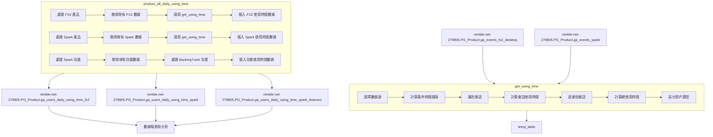

# New Infrastructure 數據分析專案

## 專案概述

本專案是一個數據基礎設施重構專案，包含一系列 SQL 查詢和存儲過程，用於處理多個產品（包括 FX2 和 Spark）的使用時間數據。這些查詢從產品事件數據中提取信息，計算使用時間統計，並分析特定功能的使用情況，以支持產品決策和用戶體驗優化。

## 數據來源

這些查詢從多個數據源獲取信息：
- FX2 事件數據 (`nimble-net-279805.PG_Product.ga_events_fx2_desktop`)
- Spark 事件數據 (`nimble-net-279805.PG_Product.ga_events_spark`)

## 專案用途

這些 SQL 查詢是定期運行的作業，用於：
- 計算產品使用時間統計
- 分析特定功能的使用情況（如 BackingTrack）
- 區分不同的使用模式（桌面版、混合版或插件版）
- 支持產品使用情況監控和用戶行為分析
- 為產品決策提供數據支持

## 主要文件及功能

### 1. 使用時間計算存儲過程 (`get_using_time`)

此存儲過程計算指定產品和功能的使用時間統計。

**資料流:** 
- **輸入參數**:
  - `product`: 產品名稱（如 "fx2" 或 "spark"）
  - `feature`: 功能名稱（如 "BackingTrack"）
- **輸入表**:
  - `nimble-net-279805.PG_Product.ga_events_fx2_desktop` - FX2 事件數據（當 product = "fx2"）
  - `nimble-net-279805.PG_Product.ga_events_spark` - Spark 事件數據（當 product = "spark"）

**主要功能：**
- 根據產品類型選擇相應的事件數據
- 處理事件時間間隔，識別會話
- 計算使用時間統計
- 區分不同的使用模式（桌面版、混合版或插件版）
- 過濾特定功能的使用數據

**數據處理流程：**
1. 根據產品參數選擇數據源
2. 計算事件時間間隔
3. 識別會話（超過 30 分鐘或 60 分鐘的間隔視為新會話）
4. 計算會話使用時間
5. 計算總使用時間和平均使用時間
6. 區分用戶類型（spark_app、desktop、hybrid、plugin）

### 2. 產品使用時間處理腳本 (`product_all_daily_using_time`)

此腳本調用 `get_using_time` 存儲過程，處理 FX2 和 Spark 產品的使用時間數據。

**資料流:** 
- **輸入表**: 通過 `get_using_time` 存儲過程間接使用
  - `nimble-net-279805.PG_Product.ga_events_fx2_desktop` - FX2 事件數據
  - `nimble-net-279805.PG_Product.ga_events_spark` - Spark 事件數據
- **輸出表**:
  - `nimble-net-279805.PG_Product.ga_users_daily_using_time_fx2` - FX2 使用時間數據
  - `nimble-net-279805.PG_Product.ga_users_daily_using_time_spark` - Spark 使用時間數據
  - `nimble-net-279805.PG_Product.ga_users_daily_using_time_spark_features` - Spark 特定功能使用時間數據

**主要功能：**
- 處理 FX2 產品的使用時間數據
- 處理 Spark 產品的使用時間數據
- 處理 Spark 產品特定功能（BackingTrack）的使用時間數據
- 管理數據更新（刪除舊數據，插入新數據）

**處理流程：**
1. 處理 FX2 產品使用時間
   - 刪除現有數據（如果存在）
   - 調用 `get_using_time` 存儲過程
   - 將結果插入到 `ga_users_daily_using_time_fx2` 表
2. 處理 Spark 產品使用時間
   - 刪除現有數據（如果存在）
   - 調用 `get_using_time` 存儲過程
   - 將結果插入到 `ga_users_daily_using_time_spark` 表
3. 處理 Spark 產品特定功能
   - 刪除現有數據（如果存在）
   - 處理 BackingTrack 功能使用時間
   - 將結果插入到 `ga_users_daily_using_time_spark_features` 表

## 完整資料流圖



## 資料流詳細說明

### 1. 原始數據收集

數據分析流程始於兩個主要的原始數據源：
- **FX2 事件數據** (`nimble-net-279805.PG_Product.ga_events_fx2_desktop`): 收集用戶在 FX2 產品中的各種交互事件
- **Spark 事件數據** (`nimble-net-279805.PG_Product.ga_events_spark`): 收集用戶在 Spark 產品中的各種交互事件

### 2. 使用時間計算 (get_using_time)

這是數據處理的核心步驟，主要任務是計算產品和功能的使用時間：
- 根據產品參數選擇相應的事件數據源
- 計算事件時間間隔，識別會話邊界
- 對於 Spark 產品，超過 30 分鐘的間隔視為新會話
- 對於 FX2 產品，超過 60 分鐘的間隔視為新會話
- 計算每個會話的使用時間
- 計算總使用時間、平均使用時間和使用次數
- 根據 dimension_HostName 區分用戶類型（spark_app、desktop、hybrid、plugin）
- 如果指定了功能參數，則過濾出與該功能相關的事件

### 3. 產品使用時間處理 (product_all_daily_using_time)

這個步驟調用 `get_using_time` 存儲過程，處理多個產品的使用時間數據：

#### 3.1 FX2 產品處理
- 檢查是否存在當天的 FX2 使用時間數據，如果存在則刪除
- 調用 `get_using_time` 存儲過程，處理 FX2 產品的使用時間
- 將結果從臨時表插入到 `nimble-net-279805.PG_Product.ga_users_daily_using_time_fx2` 表

#### 3.2 Spark 產品處理
- 檢查是否存在當天的 Spark 使用時間數據，如果存在則刪除
- 調用 `get_using_time` 存儲過程，處理 Spark 產品的使用時間
- 將結果從臨時表插入到 `nimble-net-279805.PG_Product.ga_users_daily_using_time_spark` 表

#### 3.3 Spark 功能處理
- 檢查是否存在當天的 Spark 功能使用時間數據，如果存在則刪除
- 處理 BackingTrack 功能：
  - 調用 `get_using_time` 存儲過程，處理 Spark 產品的 BackingTrack 功能
  - 將結果從臨時表插入到 `nimble-net-279805.PG_Product.ga_users_daily_using_time_spark_features` 表

### 4. 數據分析和報表

所有這些處理的結果最終用於：
- 產品使用情況監控
- 用戶行為分析
- 功能使用情況分析
- 產品決策和用戶體驗優化

## 資料表關係總結

```
原始數據源:
  ├── nimble-net-279805.PG_Product.ga_events_fx2_desktop (FX2 事件數據)
  └── nimble-net-279805.PG_Product.ga_events_spark (Spark 事件數據)
      │
      ▼
      │
      ├─────────────────┬─────────────────────────┐
      │                 │                         │
      ▼                 ▼                         ▼
ga_users_daily_using_time_fx2  ga_users_daily_using_time_spark  ga_users_daily_using_time_spark_features
(FX2 使用時間數據)           (Spark 使用時間數據)            (Spark 功能使用時間數據)
      │                       │                              │
      │                       │                              │
      └───────────────────────┴──────────────────────────────┘
                              │
                              ▼
                        數據報表和分析結果
```

## 使用模式定義

在使用時間計算中，用戶被分為以下幾類：

- **spark_app**: Spark 移動應用用戶
- **desktop**: 桌面版用戶（如 BIAS FX 2、BIAS FX 2_x64）
- **hybrid**: 混合版用戶（包含 "BIAS FX 2" 字符串但不完全匹配桌面版）
- **plugin**: 插件版用戶（其他所有用戶）
