# Spark 數據分析專案

## 專案概述

本專案包含一系列 SQL 查詢，用於分析 Spark 產品的用戶行為、使用情況和留存率。這些查詢從多個數據源獲取信息，包括 Google Analytics 數據、用戶屬性表和使用時間數據，以生成全面的產品分析報告。

## 數據來源

這些查詢從多個數據源獲取信息：
- Google Analytics 數據 (`jamup-editor.analytics_190766979.events_*`)
- 用戶每日使用時間數據 (`nimble-net-279805.PG_Product.ga_users_day_using_time`)
- spark 用戶屬性數據 (`nimble-net-279805.PG_Product.ga_users_property`)


## 專案用途

這些 SQL 查詢是定期運行的作業，用於：
- 產品使用情況監控
- 用戶行為分析
- 留存率和流失率追蹤
- 用戶使用時間分析
- 產品決策和營銷策略支持


## 主要文件及功能

### 1. 用戶屬性處理 (`ga_users_property`)

此查詢處理和更新用戶屬性數據，包括設備信息、地區、平台等。

**資料流:**
- **輸入表**: `jamup-editor.analytics_190766979.events_*` - Spark 應用的 Google Analytics 事件數據
- **輸出表**: `nimble-net-279805.PG_Product.ga_users_property`

**主要功能：**
- 處理 Spark 用戶數據，包括 IMEI、email、地區、平台、設備型號等
- 處理設備型號 (devicemodel)，識別特定型號 (40, mini, go)

**數據處理流程：**
1. 提取 Spark 用戶數據
2. 處理用戶屬性
3. 聚合用戶屬性
4. 處理設備型號

### 2. 每日使用時間計算 (`ga_users_day_using_time`)

此查詢計算用戶每天使用 Spark 應用的時間統計。

**資料流:** 
- **輸入表**: `jamup-editor.analytics_190766979.events_*` - Spark 應用的 Google Analytics 事件數據
- **輸出表**: `nimble-net-279805.PG_Product.ga_users_day_using_time`

**主要功能：**
- 計算每個用戶每天的使用時間統計
- 識別會話和子會話
- 排除 user_engagement 的事件
- 計算使用次數和使用時間

**關鍵指標：**
- 用戶每天使用次數 (day_times)
- 總使用時間 (using_time)，單位為分鐘
- 平均每次使用的時間 (avg_day_times_time)

### 3. 流失率計算 (`weekly_spark_app_churn_rate`)

此查詢計算 Spark 應用的用戶流失率。

**資料流:** 
- **輸入表**:
  - `nimble-net-279805.PG_Product.ga_users_property` - 用戶屬性數據
  - `nimble-net-279805.PG_Product.ga_users_day_using_time` - 用戶每日使用時間數據
- **輸出表**: `nimble-net-279805.PG_Product.weekly_spark_app_churn_rate`

**主要功能：**
- 獲取用戶首次使用日期
- 計算用戶使用情況
- 分類用戶類型（流失用戶、休眠用戶、持續使用的用戶）

**關鍵指標：**
- 用戶首次使用距今的天數 
- 用戶最後使用距今的天數 
- 用戶的使用天數 
- 用戶的使用時間範圍 
- 用戶的平均使用間隔

### 4. 留存率計算 (`product_spark_weekly_update_retention_rate`)

此查詢計算 Spark 應用的用戶留存率。

**資料流:** 
- **輸入表**: `jamup-editor.analytics_190766979.events_*` - Spark 應用的 Google Analytics 事件數據
- **輸出表**: `nimble-net-279805.PG_Product.weekly_spark_app_retention_rate`

**主要功能：**
- 計算週活躍用戶
- 計算週留存率

**關鍵指標：**
- 用戶留存率 (retention_rate)
- 首次活躍用戶數量 (cohort_users)

### 5. 整體留存率計算 (`weekly_spark_app_retention_rate_okr`)

此查詢計算 Spark 應用的整體留存率，用於 OKR 追蹤。

**資料流:** 
- **輸入表**: `nimble-net-279805.PG_Product.weekly_spark_app_retention_rate` - Spark 應用的留存率數據
- **輸出表**: `nimble-net-279805.PG_Product.weekly_spark_app_retention_rate_okr`

**主要功能：**
- 週留存率數據
- 計算平均留存率
- 計算事件日期

**關鍵指標：**
- 平均留存率 (avg_retentionrate)
- 事件日期 (event_date)

### 6. 平均使用時間計算 (`weekly_spark_app_avg_using_time`)

此查詢計算 Spark 應用的平均使用時間。

**資料流:** 
- **輸入表**:
  - `nimble-net-279805.PG_Product.ga_users_property` - 用戶屬性數據
  - `nimble-net-279805.PG_Product.ga_users_day_using_time` - 用戶每日使用時間數據
- **輸出表**: `nimble-net-279805.PG_Product.weekly_spark_app_avg_using_time`

**主要功能：**
- 獲取用戶地區信息
- 計算每日平均使用時間
- 計算整體平均使用時間

**關鍵指標：**
- 每日平均使用時間 (day_avg_using_time)
- 整體平均使用時間 (avg_using_time)
- 用戶數量 (users)


## 完整資料流圖

```mermaid
flowchart TD
    %% 原始數據源
    GA[jamup-editor.analytics_190766979.events_*] --> UserProperty
    GA --> DailyUsingTime
    GA --> RetentionRate
    
    %% 用戶屬性處理
    subgraph UserProperty[product_all_weekly_update_user_property]
        UP1[提取 Spark 用戶數據] --> UP2[處理用戶屬性]
        UP2 --> UP3[處理設備型號]
    end
    
    %% 輸出到 ga_users_property
    UserProperty --> USERS_PROPERTY[nimble-net-279805.PG_Product.ga_users_property]
    
    %% 每日使用時間計算
    subgraph DailyUsingTime[product_spark_weekly_update_daily_using_time]
        DU1[提取事件數據] --> DU2[計算最早/最晚事件時間]
        DU2 --> DU3[識別會話]
        DU3 --> DU4[處理會話路徑]
        DU4 --> DU5[計算子會話]
        DU5 --> DU6[計算使用時間]
        DU6 --> DU7[計算使用次數]
        DU7 --> DU8[計算使用時間百分比]
    end
    
    %% 輸出到 ga_users_day_using_time
    DailyUsingTime --> DAILY_USING_TIME[nimble-net-279805.PG_Product.ga_users_day_using_time]
    
    %% 流失率計算
    USERS_PROPERTY --> ChurnRate
    DAILY_USING_TIME --> ChurnRate
    
    subgraph ChurnRate[product_spark_weekly_update_churn_rate]
        CR1[獲取用戶首次使用日期] --> CR2[計算使用天數]
        CR3 --> CR4[計算使用時間範圍]
        CR4 --> CR5[計算平均使用間隔]
        CR5 --> CR6[分類用戶類型]
        CR6 --> CR7[計算各類型用戶數量]
    end
    
    %% 輸出到 weekly_spark_app_churn_rate
    ChurnRate --> CHURN_RATE[nimble-net-279805.PG_Product.weekly_spark_app_churn_rate]
    
    %% 留存率計算
    subgraph RetentionRate[product_spark_weekly_update_retention_rate]
        RR1[計算週活躍用戶] --> RR2[分類新/老用戶]
        RR2 --> RR3[計算每週用戶數量]
        RR3 --> RR4[計算週留存率]
        RR4 --> RR5[合併留存率結果]
    end
    
    %% 輸出到 weekly_spark_app_retention_rate
    RetentionRate --> RETENTION_RATE[nimble-net-279805.PG_Product.weekly_spark_app_retention_rate]
    
    %% 整體留存率計算
    RETENTION_RATE --> OverallRetentionRate
    
    subgraph OverallRetentionRate[product_spark_weekly_update_overall_retention_rate]
        OR1[過濾週留存率數據] --> OR2[計算平均留存率]
        OR2 --> OR3[計算事件日期]
    end
    
    %% 輸出到 weekly_spark_app_retention_rate_okr
    OverallRetentionRate --> OVERALL_RETENTION[nimble-net-279805.PG_Product.weekly_spark_app_retention_rate_okr]
    
    %% 平均使用時間計算
    USERS_PROPERTY --> AvgUsingTime
    DAILY_USING_TIME --> AvgUsingTime
    
    subgraph AvgUsingTime[product_spark_weekly_update_overall_avg_using_time]
        AU1[獲取用戶地區信息] --> AU2[獲取用戶使用數據]
        AU2 --> AU3[計算每日平均使用時間]
        AU3 --> AU4[按週分組]
        AU4 --> AU5[計算整體平均使用時間]
    end
    
    %% 輸出到 weekly_spark_app_avg_using_time
    AvgUsingTime --> AVG_USING_TIME[nimble-net-279805.PG_Product.weekly_spark_app_avg_using_time]
    
    %% 數據分析和報表
    CHURN_RATE --> Reports[數據報表和分析]
    OVERALL_RETENTION --> Reports
    AVG_USING_TIME --> Reports
```




## 資料流詳細說明

### 1. 原始數據收集

數據分析流程始於主要的原始數據源：
- **Spark 應用的 Google Analytics 事件數據** (`jamup-editor.analytics_190766979.events_*`): 收集用戶在 Spark 應用中的各種交互事件

### 2. 用戶屬性處理 (product_all_weekly_update_user_property)

這是數據處理的第一步，主要任務是處理和更新用戶屬性數據：
- 從 Google Analytics 中提取 Spark 用戶數據
- 處理用戶屬性，包括 IMEI、email、地區、平台、設備型號等
- 將用戶按 user_pseudo_id 分組，聚合屬性數據
- 處理設備型號 (devicemodel)，識別特定型號 (40, mini, go)

處理後的數據輸出到 `nimble-net-279805.PG_Product.ga_users_property` 表，這是後續分析的基礎數據源之一。

### 3. 每日使用時間計算 (product_spark_weekly_update_daily_using_time)

這個步驟專注於計算用戶每天使用 Spark 應用的時間：
- 從 Google Analytics 中提取事件數據
- 計算每個用戶每天的最早和最晚事件時間
- 使用 ga_session_number 參數識別會話
- 根據 event_bundle_sequence_id 識別會話中的間隔
- 計算子會話編號 (sub_session_sno)
- 計算每個用戶每天的使用次數 (day_times)
- 計算每個用戶每天的使用時間 (using_time)，單位為分鐘
- 計算每次使用的平均時間 (avg_day_times_time)
- 計算應用打開的總時間 (open_app_time)
- 計算使用時間百分比 (usepercent)

分析結果輸出到 `nimble-net-279805.PG_Product.ga_users_day_using_time` 表，提供用戶使用時間的詳細統計。

### 4. 流失率計算 (product_spark_weekly_update_churn_rate)

這個步驟計算 Spark 應用的用戶流失率：
- 從 `nimble-net-279805.PG_Product.ga_users_property` 表中獲取用戶的首次使用日期 (touch_1st_day)
- 獲取用戶的硬件連接狀態 (hw) 和最後事件 (last_event)
- 從 `nimble-net-279805.PG_Product.ga_users_day_using_time` 表中獲取用戶的使用數據
- 計算用戶首次使用距今的天數 (r_1st_day)
- 計算用戶最後使用距今的天數 (r)
- 計算用戶的使用天數 (f)
- 計算用戶的使用時間範圍 (lvt)
- 計算用戶的平均使用間隔 (gap)
- 根據用戶的最後事件和最後使用距今的天數，將用戶分為三類:
  - "R" (流失用戶): 最後事件為 "Y" (對應 "app_remove")
  - "S" (休眠用戶): 最後使用距今超過 30 天
  - "E" (活躍用戶): 其他用戶
- 按硬件連接狀態 (hw) 和用戶類型 (type) 分組
- 計算每組的用戶數量

分析結果輸出到 `nimble-net-279805.PG_Product.weekly_spark_app_churn_rate` 表，提供用戶流失率的統計。

### 5. 留存率計算 (product_spark_weekly_update_retention_rate)

這個步驟計算 Spark 應用的用戶留存率：
- 從 Google Analytics 中獲取用戶的活躍週數據
- 計算用戶的首次使用週 (first_touch_week) 和首次活躍週 (first_date)
- 根據首次使用週和首次活躍週是否相同，將用戶分為新用戶 (N) 和老用戶 (E)
- 從 Google Analytics 中獲取用戶的活躍日數據
- 計算用戶的首次使用日 (first_touch_date) 和首次活躍日 (first_date)
- 根據首次使用日和首次活躍日是否相同，將用戶分為新用戶 (N) 和老用戶 (E)
- 計算每個首次活躍日的用戶數量 (cohort_users)
- 計算每個用戶在首次活躍後第 n 天的活躍情況
- 計算第 n 天的留存率 = 第 n 天活躍的用戶數 / 首次活躍的用戶數
- 計算每個首次活躍週的用戶數量 (cohort_users)
- 計算每個用戶在首次活躍後第 n 週的活躍情況
- 計算第 n 週的留存率 = 第 n 週活躍的用戶數 / 首次活躍的用戶數
- 合併週留存率和日留存率的結果
- 按用戶類型 (新用戶/老用戶) 分別計算留存率

分析結果可能輸出到 `nimble-net-279805.PG_Product.weekly_spark_app_retention_rate` 表，提供用戶留存率的統計。

### 6. 整體留存率計算 (product_spark_weekly_update_overall_retention_rate)

這個步驟計算 Spark 應用的整體留存率，用於 OKR 追蹤：
- 從 `nimble-net-279805.PG_Product.weekly_spark_app_retention_rate` 表中獲取週留存率數據
- 過濾條件: daterange="W" (週數據), type="ALL" (所有用戶), n_day=1 (第 1 週留存)
- 按 daterange 和 type 分組
- 計算平均留存率 (avg_retentionrate)

分析結果輸出到 `nimble-net-279805.PG_Product.weekly_spark_app_retention_rate_okr` 表，提供整體留存率的統計。

### 7. 平均使用時間計算 (product_spark_weekly_update_overall_avg_using_time)

這個步驟計算 Spark 應用的平均使用時間：
- 從 `nimble-net-279805.PG_Product.ga_users_property` 表中獲取用戶的地區信息 (region)
- 從 `nimble-net-279805.PG_Product.ga_users_day_using_time` 表中獲取用戶的使用數據
- 關聯用戶地區信息
- 計算每個用戶的平均每日使用時間 (day_avg_using_time)
- 按用戶 ID、事件日期和地區分組
- 按週分組
- 計算所有用戶的平均使用時間 (avg_using_time)
- 計算用戶數量 (users)

分析結果輸出到 `nimble-net-279805.PG_Product.weekly_spark_app_avg_using_time` 表，提供平均使用時間的統計。

### 8. 數據分析和報表

所有這些處理和分析的結果最終用於：
- 產品使用情況監控
- 用戶行為分析
- 留存率和流失率追蹤
- 用戶使用時間分析
- 產品決策和營銷策略支持

## 資料表關係總結

```
原始數據源:
  └── jamup-editor.analytics_190766979.events_* (Spark 應用的 Google Analytics 事件數據)
      │
      ▼
nimble-net-279805.PG_Product.ga_users_property (用戶屬性數據)
      │
      ├─────────────────┬─────────────────────────┐
      │                 │                         │
      ▼                 │                         │
jamup-editor.analytics_190766979.events_*         │
(Spark 應用的 Google Analytics 事件數據)          │
      │                 │                         │
      ▼                 ▼                         │
nimble-net-279805.PG_Product.ga_users_day_using_time
(用戶每日使用時間數據)
      │                                           │
      ├─────────────────┬─────────────────────────┘
      │                 │                         
      ▼                 ▼                         
nimble-net-279805.PG_Product.weekly_spark_app_churn_rate
(用戶流失率數據)
      │                 
      │                 
nimble-net-279805.PG_Product.weekly_spark_app_retention_rate
(用戶留存率數據)
      │
      ▼
nimble-net-279805.PG_Product.weekly_spark_app_retention_rate_okr
(整體留存率數據)
      │
      ▼
nimble-net-279805.PG_Product.weekly_spark_app_avg_using_time
(平均使用時間數據)
      │
      ▼
    數據報表和分析結果
```
